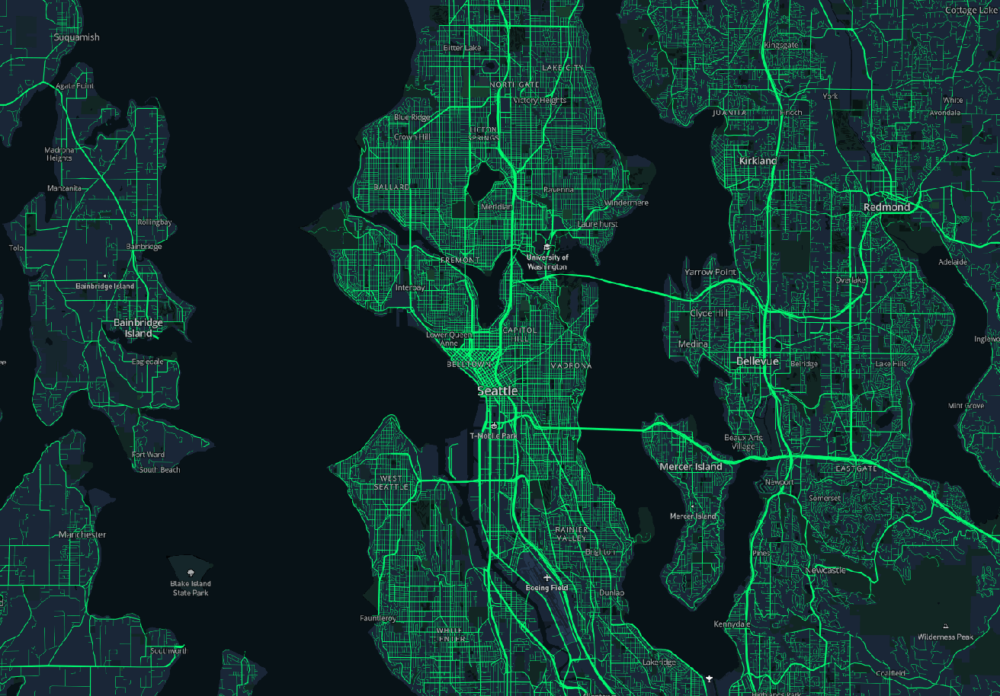
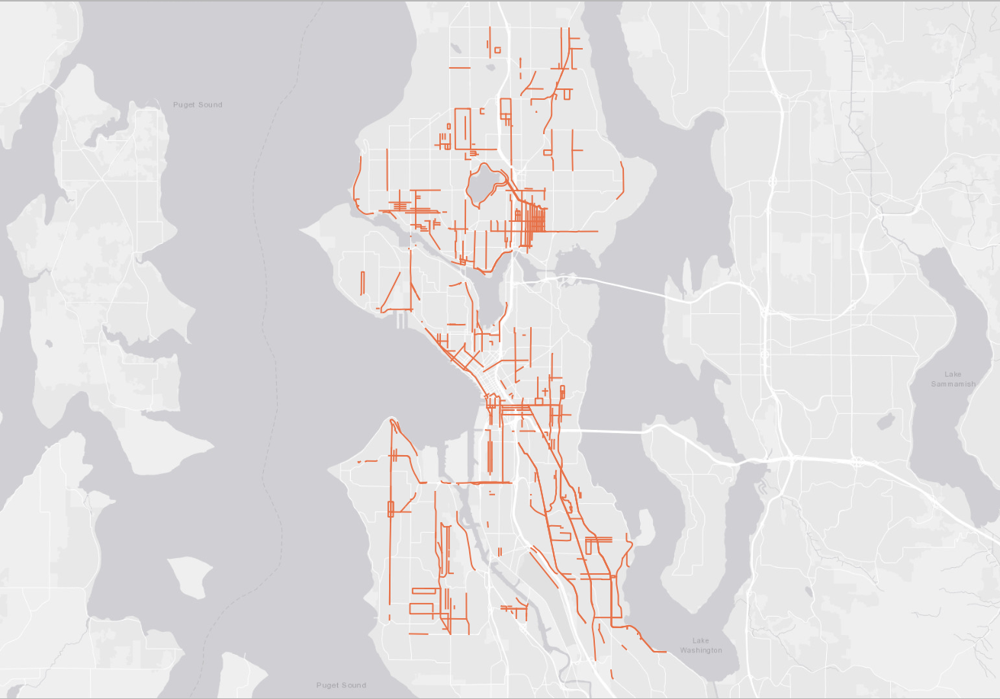
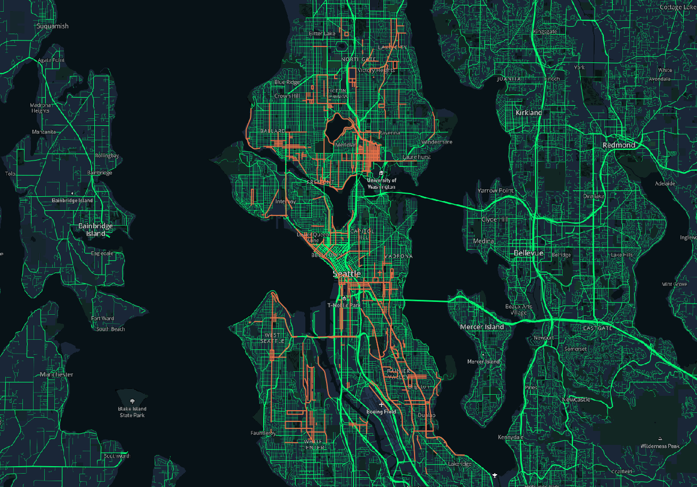
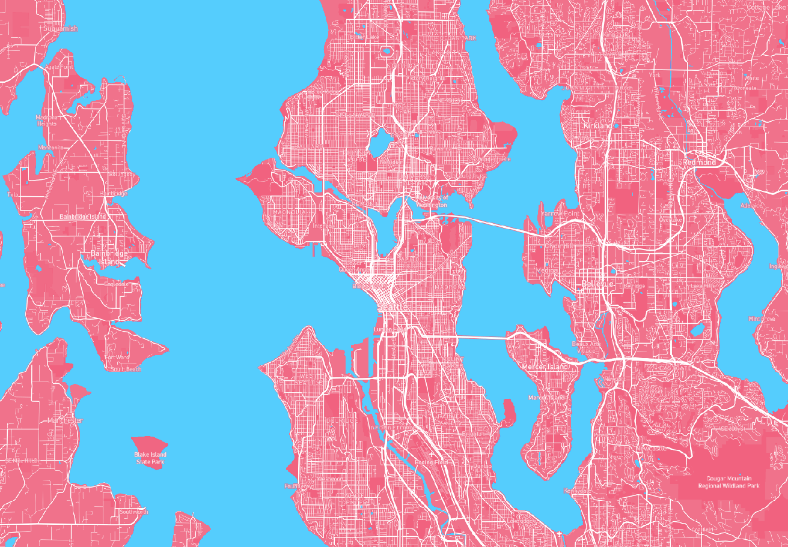

# GEOG 458 Lab 4

## By Lizhi Peng

## Tile 1 Screenshot - Modified Basemap

- Description of Tile: Modified basemap highlighting the roads and streets in the greater Seattle area.
- Geographic Area of Focus: Seattle, WA and surrounding municipalities
- Zoom Levels: Max Zoom - 14; Min Zoom - 10

## Tile 2 Screenshot - Map Data (Unreinforced Masonry Buildings, Seattle)

- Description of Tile: Data layer showing the "claimed" streets by the ["Adopt a Street"](https://data-seattlecitygis.opendata.arcgis.com/datasets/adopt-a-street) volunteer clean up program.
- Geographic Area of Focus: Seattle, WA
- Zoom Levels: Max Zoom - 14; Min Zoom - 10

## Tile 3 Screenshot - Basemap and Data

- Description of Tile: Tile utilizing the modified basemap from Tile 1 & the map data from Tile 2
- Geographic Area of Focus: Seattle, WA and surrounding municipalities
- Zoom Levels: Max Zoom - 14; Min Zoom - 10

## Tile 4 Screenshot - Trans Pride Theme

- Description of Tile: Map tile made using the color palette from the trans pride flag.
- Geographic Area of Focus: Seattle, WA and surrounding municipalities
- Zoom Levels: Max Zoom - 14; Min Zoom - 10
